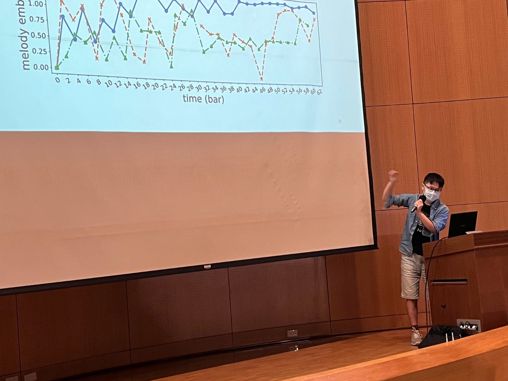

<!-- </img> -->

(由於剛好要一篇文章給系刊，於是我想說就順便也 update 到 Medium)

Links: [電機之友連結(系刊)](https://alumni.ee.ntu.edu.tw/?p=5853) | [Fb post](https://www.facebook.com/story.php?story_fbid=pfbid02xqJrtMWLae1PDGLUDPNYBghpeHygDF8qJ1w6WCgmG8WjSRwknnzdZFgASUjm12Rtl&id=173091216049572)

非常榮幸這次可以在大學部精專獎的比賽中得到評審們的肯定，這對我來說無疑是研究上莫大的鼓勵。
首先我要先感謝楊奕軒老師，是他讓我有機會進入音樂科技的大門，讓我在大學期間有幸可以接觸這麼有趣的研究題目和領域。也要感謝資工系的吳士綸學長，從他身上學到很多東西。另外，也是因為楊奕軒老師的介紹下，讓我得以和德國的音樂大佬 Meinard Müller 的實驗室合作，真是難得的體驗。

我做的題目是利用深度學習技術，讓電腦來幫你創作音樂。核心的概念就是，人類給電腦一段旋律，電腦則會以這段旋律為 "主題"的，來生成出一段音樂。
關於這篇內容要寫什麼，老實說我也不太清楚，系辦也沒有給我太多設限。
如果對於生成的音樂有興趣，可以參考我的 [Demo](https://atosystem.github.io/ThemeTransformer/#demo) 網站
如果對技術一節有興趣，可以去 axXiv 看 [paper](https://arxiv.org/abs/2111.04093)
至於這篇文章要寫什麼呢？我想我來分享一下我的心路歷程好了。

會想做音樂科技的題目其實從我小的時候，就已經種下這個種子
小時候學鋼琴的時候，其實對於那些鋼琴家，或是音樂發展史，沒有太多興趣，大部分都是左耳進右耳出（長大後才發現，聊天說這些感覺會顯得很有文化 XD）。最讓我著迷的是樂理的部分，和一些作曲的概念。可能因為天生的理科思維作祟，我習慣在各種事物中，去找尋一些普遍的規律。當我發現音樂的領域也是有一些法則存在時，我異常興奮。而這些法則看似理性，卻可以在琴鍵上以感性的方式表達，融入作曲家，演奏者的心境。

> 正是這種矛盾的感覺，在我心中留下無盡的美感。

進入國中之後，不知道為何，有一段時間非常排斥音樂，也許是因為練琴練到很煩，開始產生一點抗拒。而上了高中後，在一次因緣際會下，去了中研院的 Open House 的活動，剛好看到本系的伍庭曄學長，在分享音樂資訊檢索的研究。聽完他的講解，我重新拾回那份小時候對於音樂的熱情，對於樂理的執著。
轉眼間來到了大二大三時，身旁同學開始跟專題，或去實習。我於是鼓起用氣去找楊教授，希望可以進入他的實驗室做相關的研究。在這裡非常感謝楊教授願意收留當時廢廢的我（楊老師人真的很好）。剛開始著手音樂生成（電腦作曲）的題目，其實非常挫折。我真心覺得，要我教一個完全沒有音樂經驗的人彈鋼琴，比教一個看過數千數萬首音樂的電腦模型還要難。在這個過程中，不斷的想新的方式，觀察 performance，聆聽電腦生成的結果，再回去改模型，不斷的循環，不斷迭代。簡言之，就是不斷的碰到問題，想解決方式，再找挖掘新問題。而最挫折的地方，就是電腦做出來的音樂有時候真的很難聽，久而久之，我覺得我對於音樂的包容度已經越來越大，標準也越來越低了 XD。即使這段過程挫折感很重，但是同時也成長很多，也學會享受過程，還有成就感。

音樂科技這個領域（正式來說是音樂資訊檢索 Music Information Retrieval MIR），是個相對來說很小的 community，相比於 Computer Vision (CV)， Natural Language Processing (NLP)， Speech Processing 等。雖然領域很小，但卻很溫暖。因為我想信會來做 MIR 的人，通常除了研究的熱誠，還有對於音樂的熱愛。大家的 background 也很多元：有音樂家，音樂製作人，聲音藝術家，電腦科學專家等等。
在如今各大 conference 被 deep learning paper 如海水般，指數淹沒的年代，MIR 領域在我心中，就是像是大洋中的一座小島，CV，NLP 可能就是不同的大陸。

> 研究人員就和人類非洲祖先一樣，從 CV 漸漸走到 NLP，而之後一部分的人選擇遷徙到 MIR 這座島上。有些人選擇定居，有些人則是在各地來回穿梭。很多人未必知道小島的存在，但是當你踏上這座島，會發現世外桃源。大概島上也會有 "不足爲外人道也" 的感嘆吧。

回到精專獎的主題。我很感謝這場比賽，感謝系辦的人員，還有學術部的學弟妹辛苦籌劃。這次的比賽，除了得到評審們的認可，也給予我這個機會，和大家分享音樂科技的領域，這也是很令人欣慰的，即使我現在在 MIR 領域只是一個 Level 1 的初學者。
如果學弟妹對 MIR 領域也有興趣，或本身對於音樂也有熱愛，歡迎和楊奕軒教授聯繫。如果想更了解我這段研究過程，也非常歡迎去 FB 加我好友，或是去瀏覽我的[個人網站](https://atosystem.github.io)（上面也有一些我平常無聊時的音樂創作 XD）。
