# MusicChain

> _A platform to make Original and Cover Visible and Valuable_

Demo Link : [Youtube](https://www.youtube.com/watch?v=rmtS9UxWCMc)

## Setup

1. First make sure you start your docker and Ganache. Then execute `./setup.sh`folder.

```bash
./setup.sh
```

2. After docker container starts running, execute the folling commands to alter IPFS settings. This settings is to bypass the CORS policy to let frontend can directly talk to the backend from different origins.

```bash
docker exec ipfs_host ipfs config --json API.HTTPHeaders.Access-Control-Allow-Origin '["*"]'
docker exec ipfs_host ipfs config --json API.HTTPHeaders.Access-Control-Allow-Methods '["PUT", "GET", "POST", "OPTIONS"]'
```

3. Finally restart docker container. If you start the docker-compose without datached, you may need to open another terminal and change to the project directory and then run this command.

```bash
docker-compose restart ipfs
```

## Start MusicChain website

With Ganache and docker container running (backend & ipfs), go to `./react` and execute

```bash
$ npm start
```

MusicChain is then running at [http://localhost:3000/](http://localhost:3000/)

## Clean backend database data

**Notice that you should also restart your blockchain**

```bash
./reset_backend.sh
```

### Formater

```bash
npm run format
```

## Techonologies

- IPFS
- Essentia
- Docker
- Material UI
- React

## Features

### Dashboard Page

We put our project architecture diagram in this page for clarity.

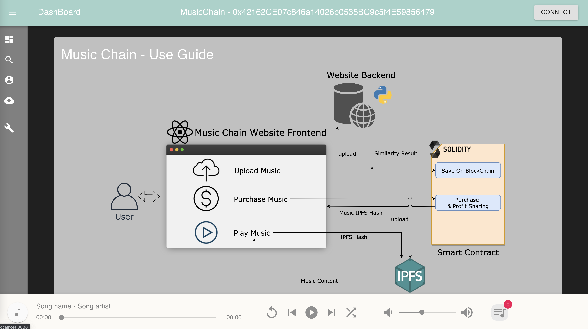

### Upload Page

In this page, user can upload their music on the blockchain. The user is required to give name, artist, and the to upload audio file. We will do some check function before the upload is actually done.

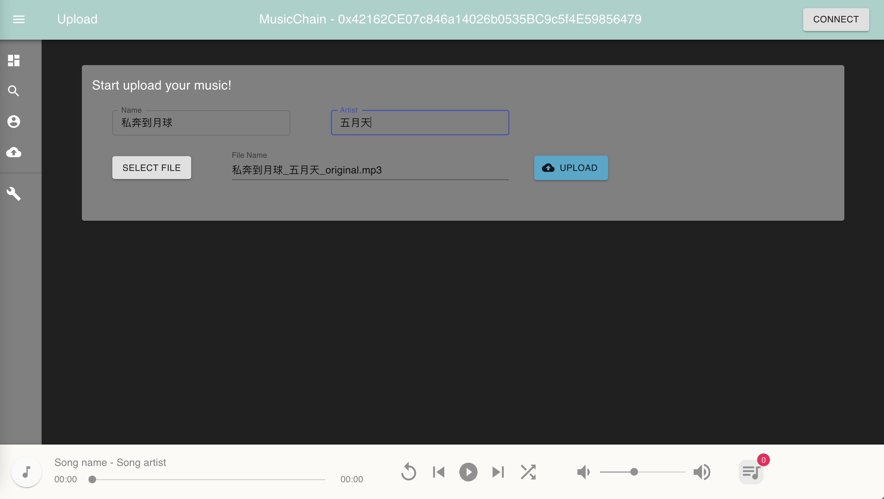

### Account Page

This page shows some user information such as uploaded list and bought list. The user can also buy tokens on this page.

We offer 3 options, 100, 1000, and 10000. The exchange ratio is Ether:Token = 1:10000.

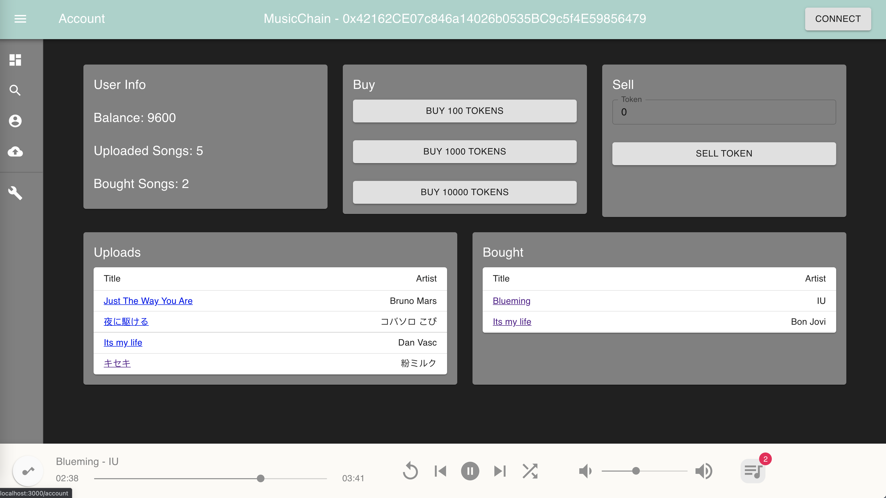

User can also sell some tokens. If the input value is greater than the balance the user has, the application will reject this transaction and show some error message, like the following shows.

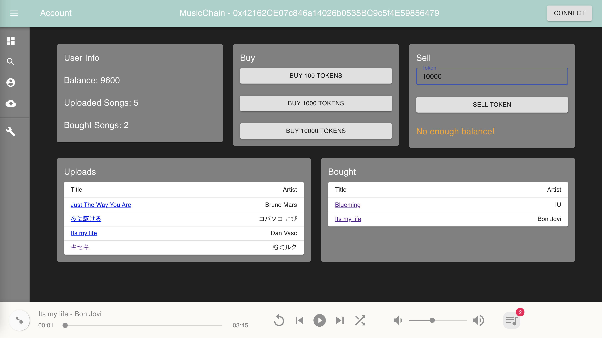

At the bottom of this page, we can see all music the user had uploaded or bought. When the user click the music title, they will be redirected to the music detail page.

### Music Detail Page

This page shows the information of a music. On the left side, it shows the metadata of the music.

#### Music Copyright Chain

On the right side, it shows the music copyright chain. Notice that user can also click music on the chain, and then they will be redirected to the that music.

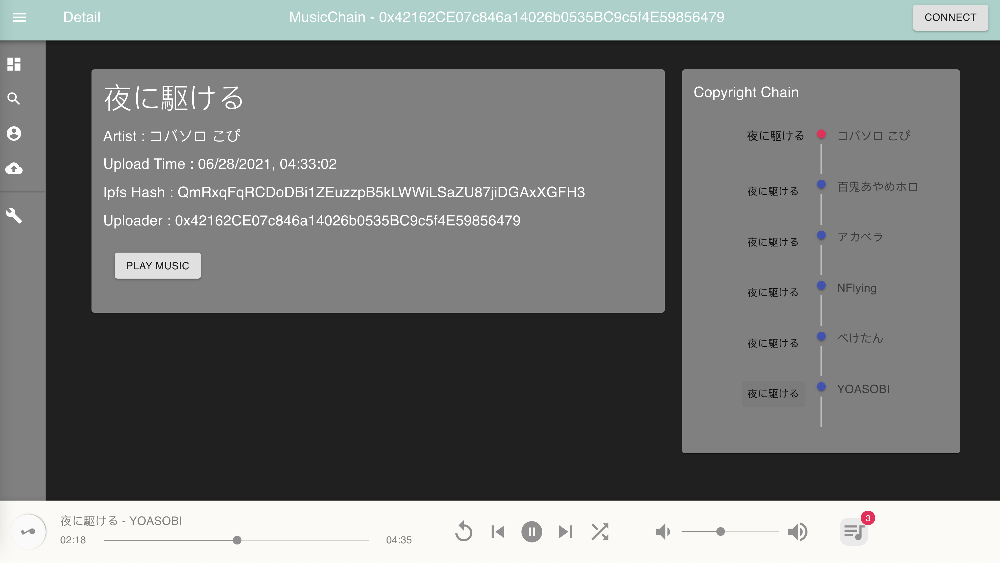

#### Buy Music

If the user had not bought this music, they can click the `BUY MUSIC` button to fire a transaction on the blockchain.

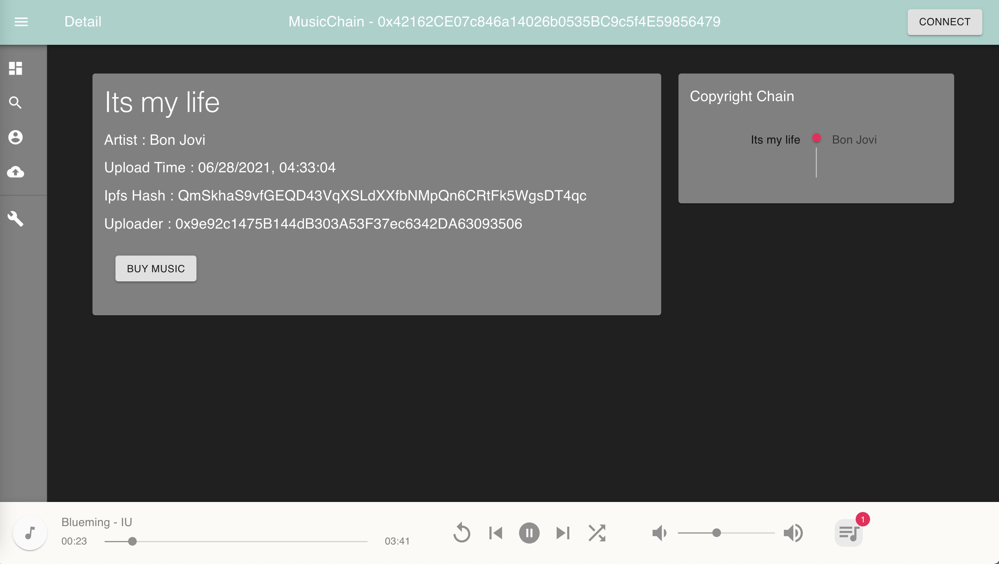

Then the metamask window will pop up to confirm the transaction.

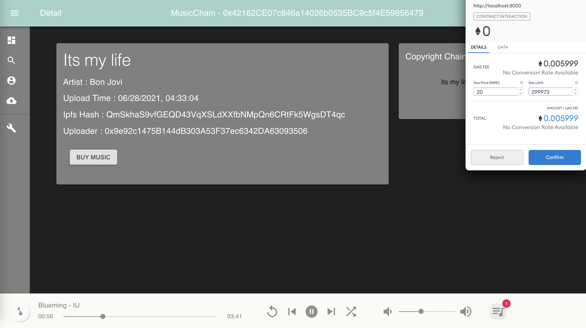

However, if a user has no enough balance, we do not allow user to buy music. The page will show some error message and the button is disabled.

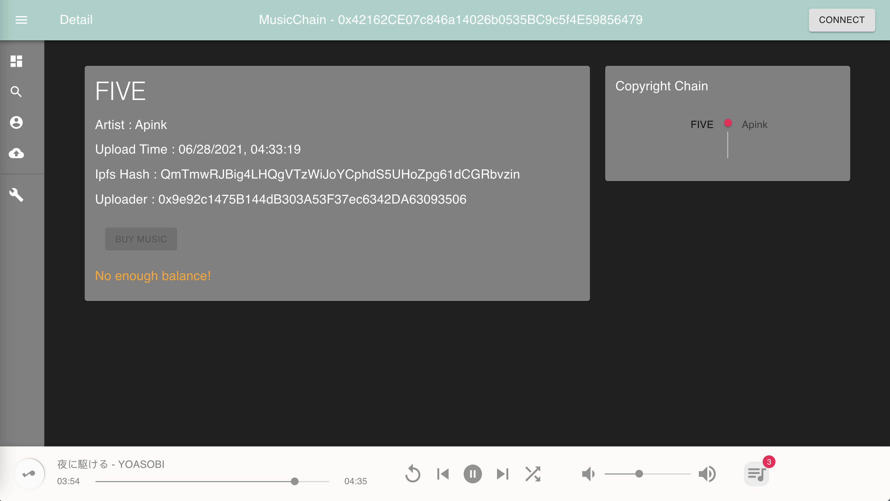

### Play Music

After the user has bought the music, the `BUT MUSIC` button becomes `PLAY MUSIC`.

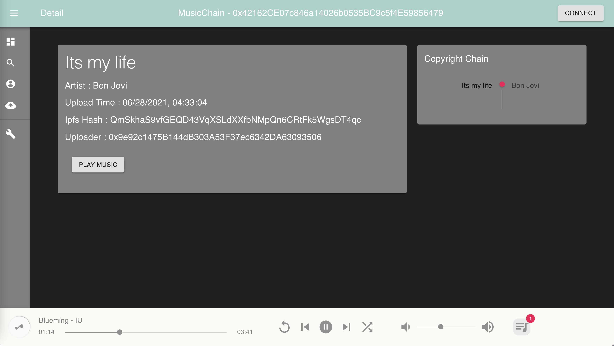

Then the user can click the button, the music will be added to the playlist, and the playing song changes, too.

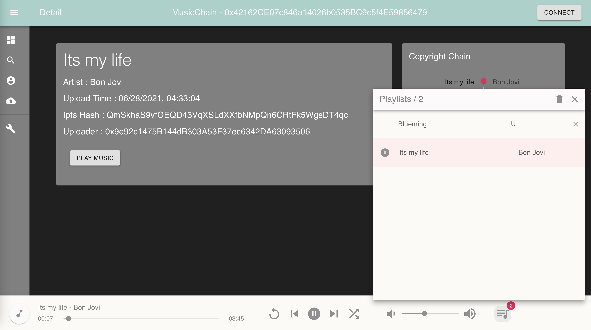

### Search Page

We implement a simple search function to find relevant music based on some keywords. If the name field and the artist field are both left unfilled, it will show all musics on the blockchain.

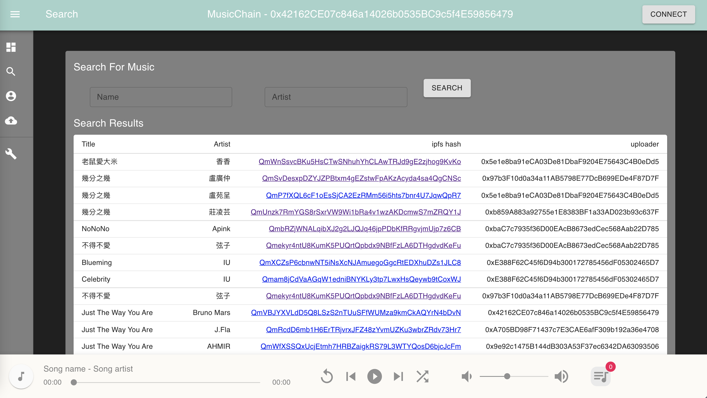

Given the music name, the website will try to find the matched result.

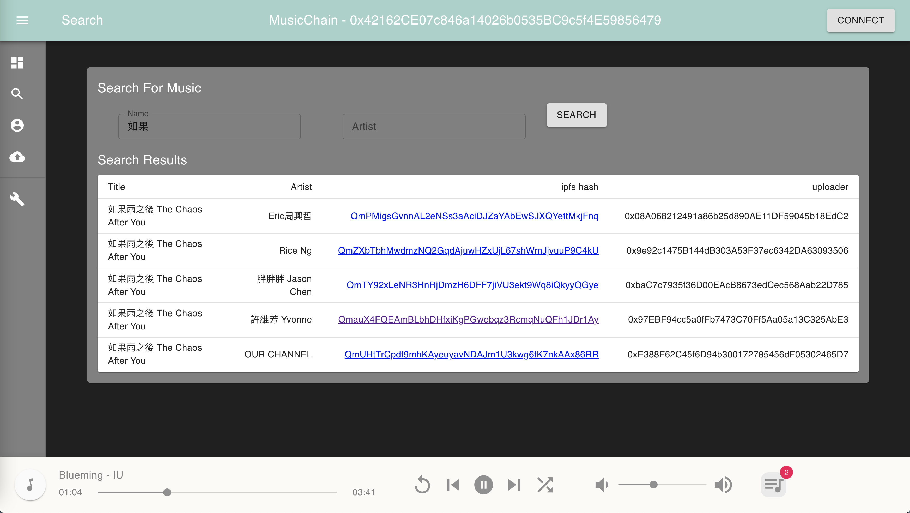

The artist case is similar.

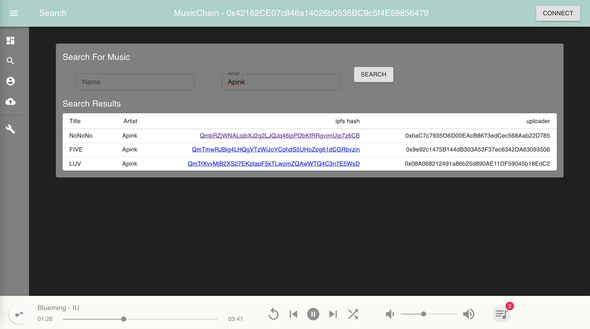

If given both keywords, the application will return the exact music if this music exists on the blockchain.

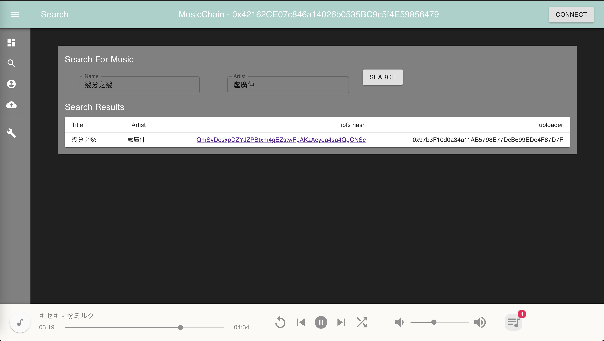

### Test Page

This page is only for developers. Developers can test functions on the smart contract in the easiest way.

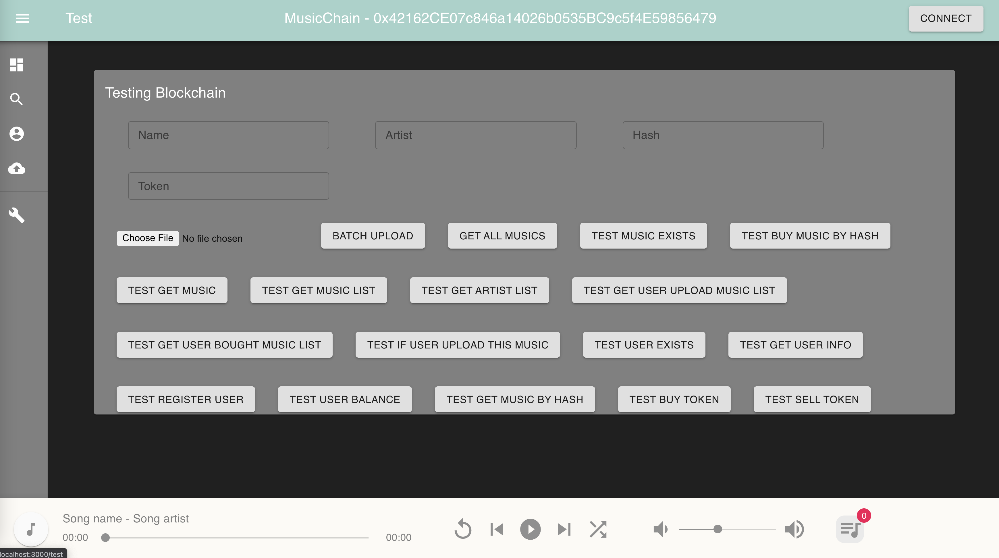

## Future Works

### More Than a Chain

In our current implementation, we only allow a music has only **one** cover from relationship. However, it is not that simple in the real world. For example, a song may be similar to 3 musics, the similarity is too close to tell which one is the right one. A even complex situation is that a song is indeed cover from 2 or more songs. In these case, some advanced implementation is needed.

### Dataset

As more and more music being uploaded, our smart contract becomes a database that contains data which can be used to train music generation ML models. Our smart contract has great potential, but we haven't fully realize how to put these dataset into real value.

### Purchase Mechanism

Based on different situation, the profit sharing may not be static. In some cases, the downloaded time of a music is way more higher then the covered song. This may due to the reinterpretation of the song or some marketing efforts. No matter what, although we still have to protect the music copyright, the profit sharing ratio is reasonably to be dynamic adjusted instead of a fixed one.
