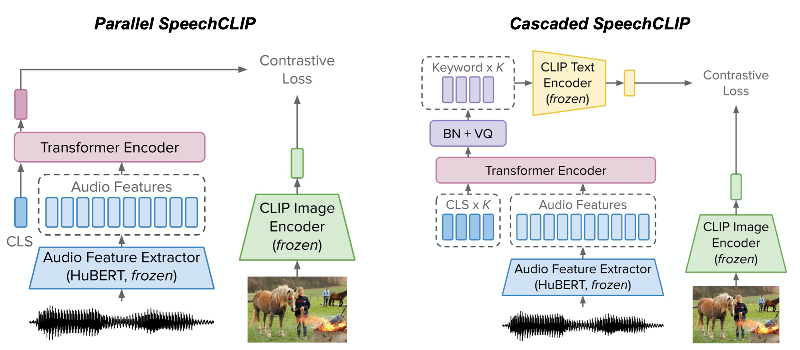
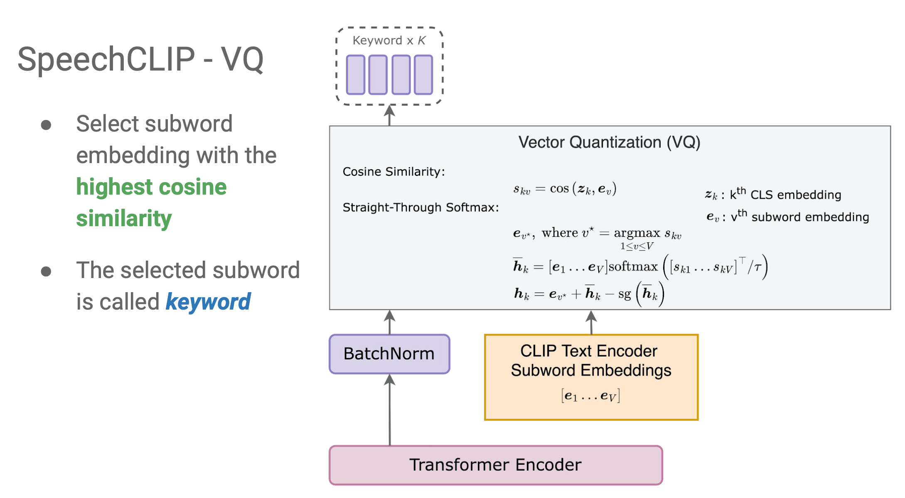
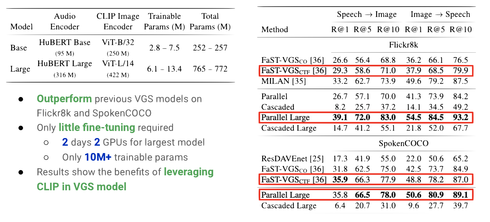
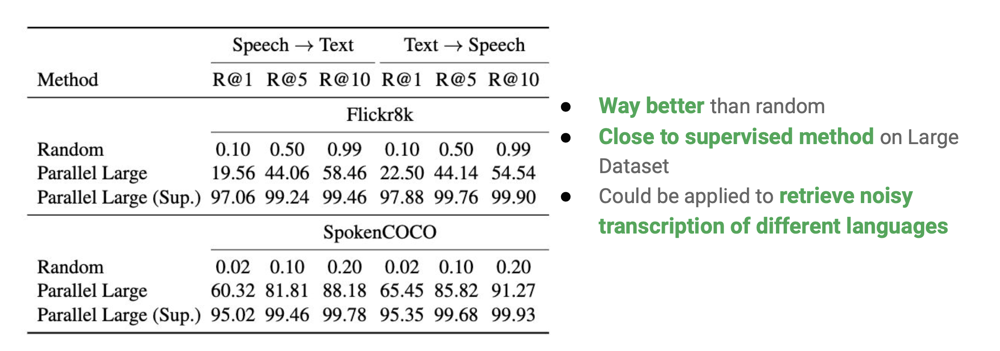
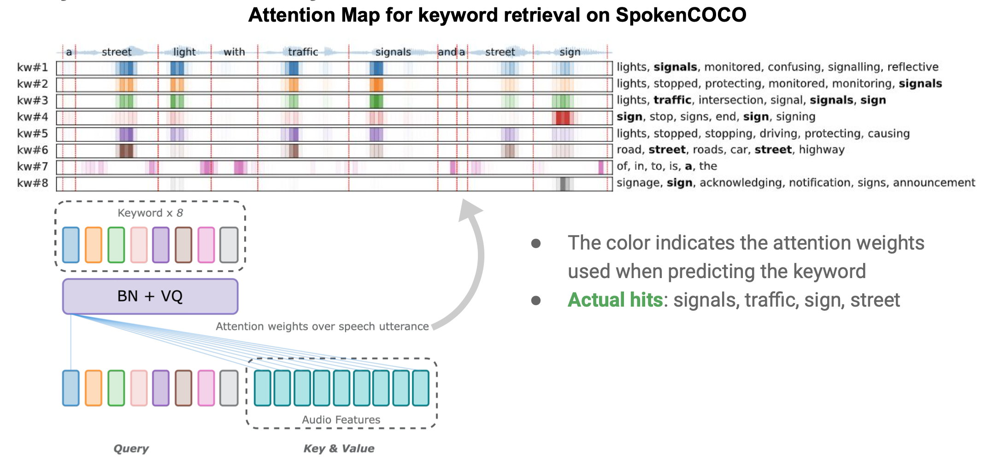
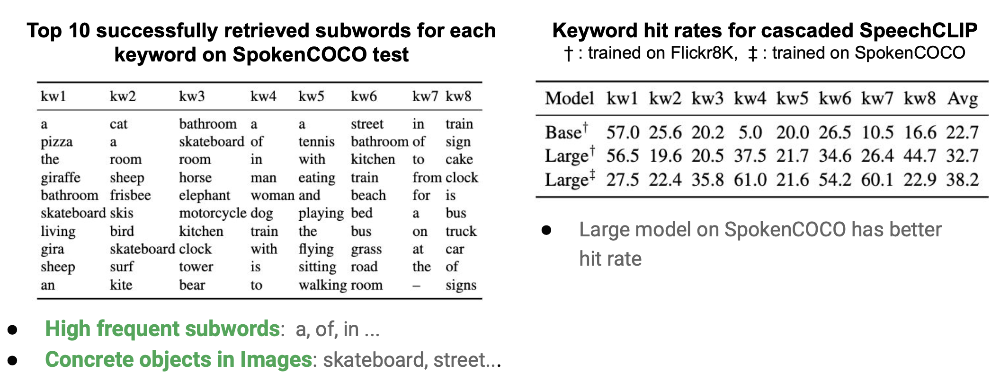

# SpeechCLIP: Integrating Speech with Pre-Trained Vision and Language Model

<!-- </img> -->


## TL;DR

Parallel speech-text data is expensive and hard to collect, compared to paired speech-image, text-image data. To this end, we utilize the large scale pretrained image-language model, CLIP and speech self-supervised model, HuBERT to bridge speech and text together. Under several design of model architecture, we achieve SOTA on image-speech retrieval and we also show that SpeechCLIP can conduct zero-shot speech-text retrieval and keywords discovery from speech utternace.

Links: [arXiv](https://arxiv.org/abs/2210.00705) | [code](https://github.com/atosystem/SpeechCLIP)

## Model Structure

In this work, we propose 2 architecture to for integrating HuBERT and CLIP.



### Vector Quantization



## Experiments

### Image-Speech Retrieval



### Zero-Shot Speech-Text Retrieval



### Keyword Discovery





## Cite our work!

```latex
@article{speechclip2022,
  title={SpeechCLIP: Integrating Speech with Pre-Trained Vision and Language Model},
  author={Yi-Jen Shih and Hsuan-Fu Wang and Heng-Jui Chang and Layne Berry and Hung-yi Lee and David Harwath},
  journal={IEEE SLT},
  year={2022},
  publisher={IEEE}
}
```
