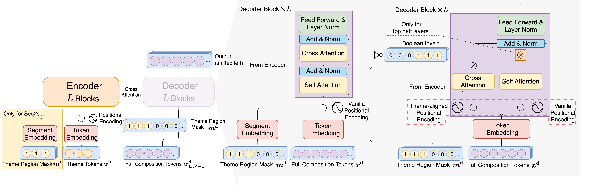
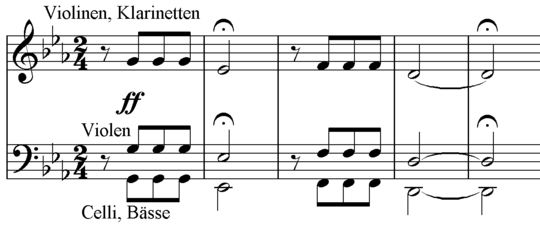
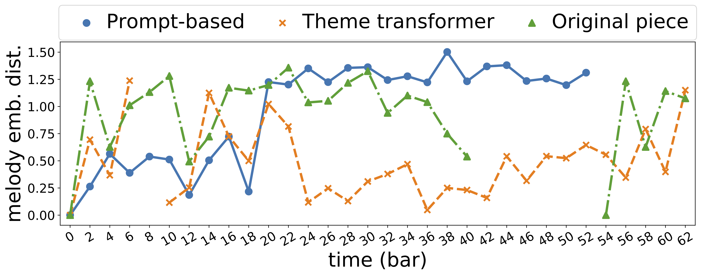

# Theme Transformer: Symbolic Music Generation with Theme-Conditioned Transformer

<!-- </img> -->

# Demo

* Given Theme 

    `audio: /theme-transformer-audio/899_Theme.mp3`
* Generated music

    | Prompt-based| Theme-based|
    | --| --|
    | `audio: /theme-transformer-audio/899_Baseline.mp3`|  `audio: /theme-transformer-audio/899_ThemeTransformer.mp3` |

(For more demo, go to [demo page](https://atosystem.github.io/ThemeTransformer/#demo))

## Links

- [Demo page](https://atosystem.github.io/ThemeTransformer/)
- [Code instruction](https://atosystem.github.io/ThemeTransformer/code)
- [Cite our work!](https://atosystem.github.io/ThemeTransformer/cite)
- [Github repo](https://github.com/atosystem/ThemeTransformer)

## Why Theme-Conditioned?

Let's first examine the way human compose music.

### Motivic Development

In Music Theory, there is a term called _Motivic Development_, which is a method for composer to _develop_ a _motif_ into an entire music piece or song. As the spirit of Motivic Development, composer first come up with a _motif_, and then they employ this musical material with adequate _variations_ to preform _development_ throughout the music piece.

- Motif

  Motif is a short musical phrase mainifesting a music idea. A common example is the first four notes in the Beethoven's Fifth Symphony, which provides the motif of the first movement.

  

  Motif often lefts strong impression on audience by its constantly recurring appeareance. As in this example, these four notes might be the most memorable melody in this symphony to the public.

- Variations

  For variations, there are several common techniques, including pitch shifting, time reversing, horizontal mirroring and so on.

- Development

  In literature, a compelling story or movie must consist of a structure of development. The same idea works in music too. However, in music, the development can be expressed in many ways, such as arrangement of instruments, variation of motif, complexity of melody etc.

> In additional to **motif**, we use the term **Theme** in this work, regarding the fact that **Motifs** are considered to be shorter and more basic. However, the distinction between theme and motifis not always drawn rigorously. **Themes** also manifest itself throughout the music via variations.

Even for modern music genre, most of them comply with this song writing mindset, as human brains tends to process structureness and repitions eaiser, which also render _repition_ and _structureness_ essential in music.

## Music Generation

After having a glimpse of music writing by human, let's see how machine does it.

In recent years, with the advanced of deep learning networks, many previous works use Transformer nertwork to model music pieces in an autoregressive manner.
That is, make the machine to predict the next note given all the previous generated notes.
Along with the powerful attention mechanism, Transformer models have the ability to generate good quality music if given abundant and clean music datasets. Nonetheless, the music generated sounds somehow random in the sense of direction.
The main culprit is that transformer model fail to learn **repition** from massive data. (It could to some extent learn to repeat local patterns, but fail to reuse the musical theme again.) To tackle this problem, we think that perhaps we should teach transformer models the way human compose a song. That is, we should apply **Theme** information into transformer models.

## Methodology

### Melody Contrastive Clustering

In our work, we trained an embedding model for melody clustering via contrastive loss.
For contrastive learning, we consider the following 3 augmentation techniques:

- Pitch shift on scale

  Keep the same contour of a melody but shift them according to their positions in the musicalscale. Note that it is different from uniformly shifting thepitches, because the distances between two adjacent notesare not equal in a Western heptatonic scale (i.e., there arewhole steps and half steps)

- Last note duration variation

  Randomly vary the durationof the last note in the melody

- Note splitting and combination

  Randomly pick a notein the melody and split it into two notes with the samepitch but half of the original duration each; or randomlycombining two neighboring notes with the same pitch.

Within these augmentation techniques are considered positve samples for contrastive learning.

After training the embedding model, we conduct DBScan clustering algorithm on the melody embeddings and search for the largest cluster.

Here is an example of the melody embedding distance visualization.

For more figures, click [here](https://atosystem.github.io/ThemeTransformer/#figures)
### Theme Transformer

The core idea of **Theme Transformer** is to utilize two memory network. One for recording the past generated music content, the other one for the theme condition. This is done by utilizing parallel cross and self attention modules with gating mechanism. The theme condition is given at the encoder side, hence cross attention can be viewed as the module for considering the _theme_ and self attention is for considering all the previous generated music content. Together, they formed a two memory network architecture.

## Feel you free to contact me!

<!--
## Demo
| ID| Theme | Real Data | Baseline | Theme Transformer
| -- | -------- | -------- | -------- | -------- |
| 875 | `audio: /theme-transformer-audio/875_Theme.mp3` | `audio: /theme-transformer-audio/875_Realdata.mp3` | `audio: /theme-transformer-audio/875_Baseline.mp3` | `audio: /theme-transformer-audio/875_ThemeTransformer.mp3`|
| 888 | `audio: /theme-transformer-audio/888_Theme.mp3` | `audio: /theme-transformer-audio/888_Realdata.mp3` | `audio: /theme-transformer-audio/888_Baseline.mp3` | `audio: /theme-transformer-audio/888_ThemeTransformer.mp3`|
| 890 | `audio: /theme-transformer-audio/890_Theme.mp3` | `audio: /theme-transformer-audio/890_Realdata.mp3` | `audio: /theme-transformer-audio/890_Baseline.mp3` | `audio: /theme-transformer-audio/890_ThemeTransformer.mp3`|
| 893 | `audio: /theme-transformer-audio/893_Theme.mp3` | `audio: /theme-transformer-audio/893_Realdata.mp3` | `audio: /theme-transformer-audio/893_Baseline.mp3` | `audio: /theme-transformer-audio/893_ThemeTransformer.mp3`|
| 899 | `audio: /theme-transformer-audio/899_Theme.mp3` | `audio: /theme-transformer-audio/899_Realdata.mp3` | `audio: /theme-transformer-audio/899_Baseline.mp3` | `audio: /theme-transformer-audio/899_ThemeTransformer.mp3`|
| 900 | `audio: /theme-transformer-audio/900_Theme.mp3` | `audio: /theme-transformer-audio/900_Realdata.mp3` | `audio: /theme-transformer-audio/900_Baseline.mp3` | `audio: /theme-transformer-audio/900_ThemeTransformer.mp3`|
| 901 | `audio: /theme-transformer-audio/901_Theme.mp3` | `audio: /theme-transformer-audio/901_Realdata.mp3` | `audio: /theme-transformer-audio/901_Baseline.mp3` | `audio: /theme-transformer-audio/901_ThemeTransformer.mp3`|
| 904 | `audio: /theme-transformer-audio/904_Theme.mp3` | `audio: /theme-transformer-audio/904_Realdata.mp3` | `audio: /theme-transformer-audio/904_Baseline.mp3` | `audio: /theme-transformer-audio/904_ThemeTransformer.mp3`|
| 908 | `audio: /theme-transformer-audio/908_Theme.mp3` | `audio: /theme-transformer-audio/908_Realdata.mp3` | `audio: /theme-transformer-audio/908_Baseline.mp3` | `audio: /theme-transformer-audio/908_ThemeTransformer.mp3`|
| 909 | `audio: /theme-transformer-audio/909_Theme.mp3` | `audio: /theme-transformer-audio/909_Realdata.mp3` | `audio: /theme-transformer-audio/909_Baseline.mp3` | `audio: /theme-transformer-audio/909_ThemeTransformer.mp3`|

## Figures
|#id| First 24 bars  &nbsp; &nbsp; &nbsp; &nbsp; &nbsp; &nbsp; &nbsp; &nbsp; &nbsp; &nbsp;   | Melody Embedding Distance|
| ------ | -------- | -------- |
|875|  |  |
|888|  |  |
|890|  |  |
|893|  |  |
|894|  |  |
|896|  |  |
|899|  |  |
|900|  |  |
|901|  |  |
|904|  |  |
|908|  |  |
|909|  |  |  -->
