# Theme Transformer: Symbolic Music Generationwith Theme-Conditioned Transformer

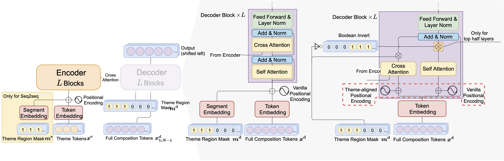
<!-- 
## Demo
| ID| Theme | Real Data | Baseline | Theme Transformer
| -- | -------- | -------- | -------- | -------- |
| 875 | `audio: /theme-transformer-audio/875_Theme.mp3` | `audio: /theme-transformer-audio/875_Realdata.mp3` | `audio: /theme-transformer-audio/875_Baseline.mp3` | `audio: /theme-transformer-audio/875_ThemeTransformer.mp3`|
| 888 | `audio: /theme-transformer-audio/888_Theme.mp3` | `audio: /theme-transformer-audio/888_Realdata.mp3` | `audio: /theme-transformer-audio/888_Baseline.mp3` | `audio: /theme-transformer-audio/888_ThemeTransformer.mp3`|
| 890 | `audio: /theme-transformer-audio/890_Theme.mp3` | `audio: /theme-transformer-audio/890_Realdata.mp3` | `audio: /theme-transformer-audio/890_Baseline.mp3` | `audio: /theme-transformer-audio/890_ThemeTransformer.mp3`|
| 893 | `audio: /theme-transformer-audio/893_Theme.mp3` | `audio: /theme-transformer-audio/893_Realdata.mp3` | `audio: /theme-transformer-audio/893_Baseline.mp3` | `audio: /theme-transformer-audio/893_ThemeTransformer.mp3`|
| 899 | `audio: /theme-transformer-audio/899_Theme.mp3` | `audio: /theme-transformer-audio/899_Realdata.mp3` | `audio: /theme-transformer-audio/899_Baseline.mp3` | `audio: /theme-transformer-audio/899_ThemeTransformer.mp3`|
| 900 | `audio: /theme-transformer-audio/900_Theme.mp3` | `audio: /theme-transformer-audio/900_Realdata.mp3` | `audio: /theme-transformer-audio/900_Baseline.mp3` | `audio: /theme-transformer-audio/900_ThemeTransformer.mp3`|
| 901 | `audio: /theme-transformer-audio/901_Theme.mp3` | `audio: /theme-transformer-audio/901_Realdata.mp3` | `audio: /theme-transformer-audio/901_Baseline.mp3` | `audio: /theme-transformer-audio/901_ThemeTransformer.mp3`|
| 904 | `audio: /theme-transformer-audio/904_Theme.mp3` | `audio: /theme-transformer-audio/904_Realdata.mp3` | `audio: /theme-transformer-audio/904_Baseline.mp3` | `audio: /theme-transformer-audio/904_ThemeTransformer.mp3`|
| 908 | `audio: /theme-transformer-audio/908_Theme.mp3` | `audio: /theme-transformer-audio/908_Realdata.mp3` | `audio: /theme-transformer-audio/908_Baseline.mp3` | `audio: /theme-transformer-audio/908_ThemeTransformer.mp3`|
| 909 | `audio: /theme-transformer-audio/909_Theme.mp3` | `audio: /theme-transformer-audio/909_Realdata.mp3` | `audio: /theme-transformer-audio/909_Baseline.mp3` | `audio: /theme-transformer-audio/909_ThemeTransformer.mp3`|

## Figures
|#id| First 24 bars  &nbsp; &nbsp; &nbsp; &nbsp; &nbsp; &nbsp; &nbsp; &nbsp; &nbsp; &nbsp;   | Melody Embedding Distance|
| ------ | -------- | -------- | 
|875| 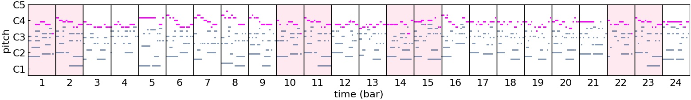 |  | 
|888| 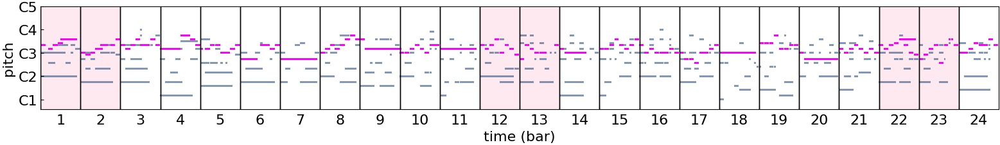 |  | 
|890| 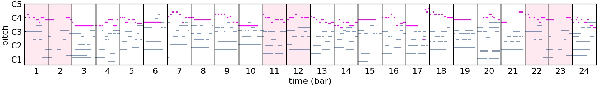 |  | 
|893| 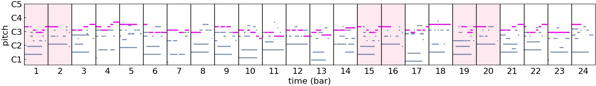 |  | 
|894| 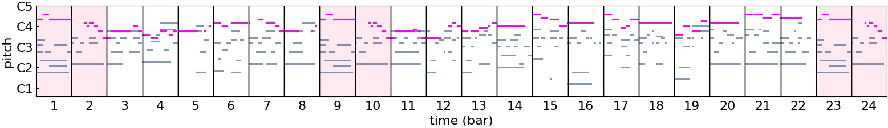 |  | 
|896| 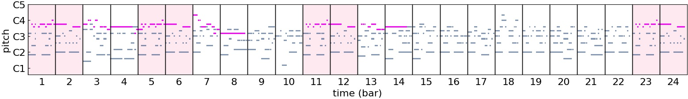 |  | 
|899| 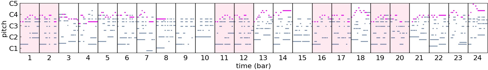 |  | 
|900| 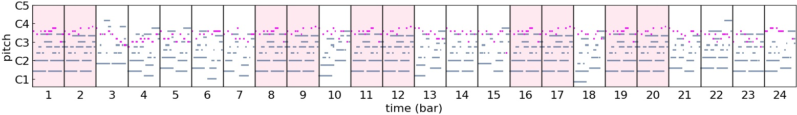 |  | 
|901| 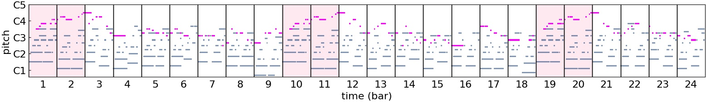 |  | 
|904| 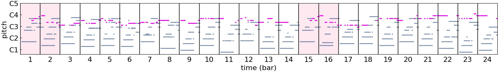 |  | 
|908| 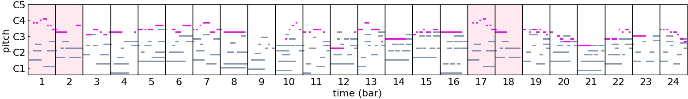 |  | 
|909| 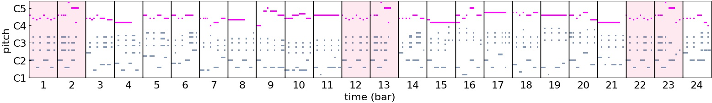 |  |  -->

