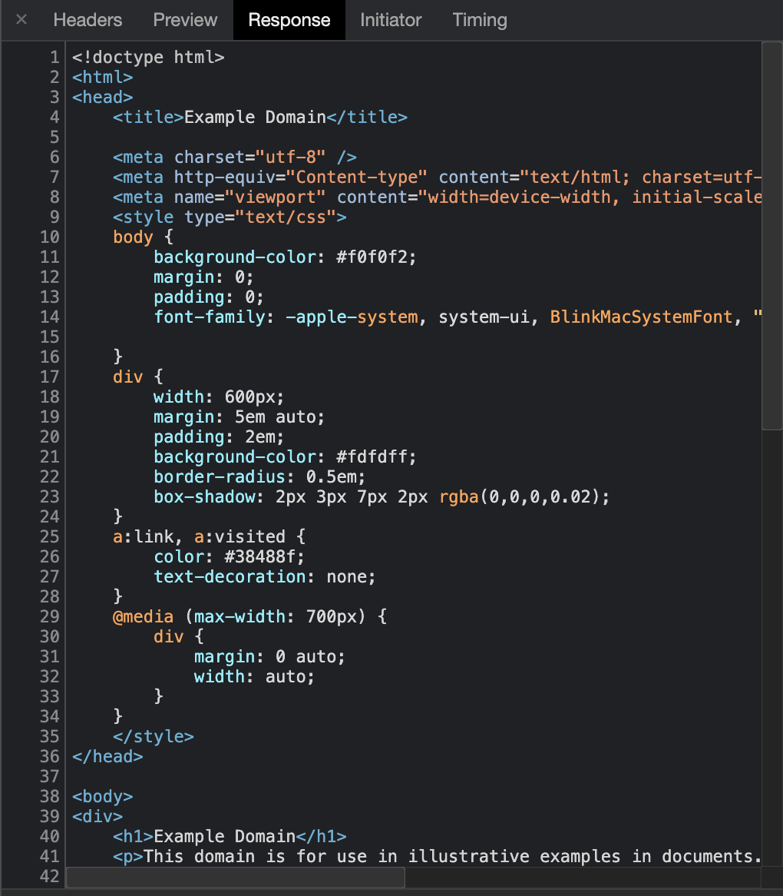
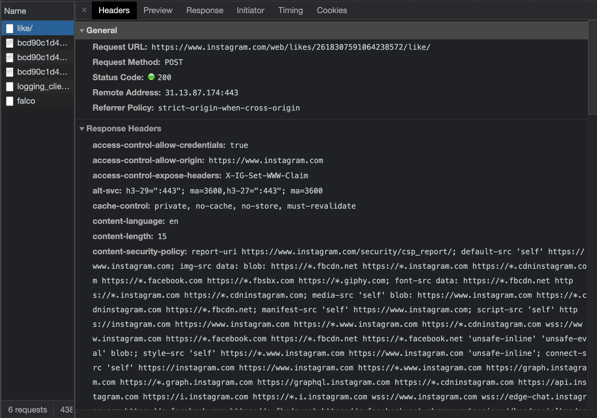

# 🔥🔥 Web Crawler Tutorial 🔥🔥

> An automated script for retrieving data from web or sending request to web servers.

> 💡 Disclaimer : Only for education purpose, do not do anything against law.

Github : [Link](https://github.com/atosystem/webcrawler_tutorial)

## 🛠️ Tools for Crawling

- [curl](https://curl.se/) (low level)
- python
  - [requests](https://pypi.org/project/requests/)
  - [beautifulsoup](https://pypi.org/project/beautifulsoup4/) (for parsing HTML,XML)
  - [selenium](https://pypi.org/project/selenium/) (simulate web browser)(Less investigating effort but low effeciency)

## 📖 Background Knowledge

(picture from [Understanding the HTTP request-response model](https://www.oreilly.com/library/view/restful-java-web/9781788294041/1889f99d-f907-41c3-a0f0-925bbf1d3825.xhtml))

* web requests and response
* stateless

> Usefull website for discovering : [get-request-example](https://reqbin.com/req/nfilsyk5/get-request-example)

## 💡 Main Idea

The data appeared on webpage is fetched from backend server via our web browser when we visit a url or we trigger some event on the webpage. To fetch data automatically, we simulate the same action our browser does.

### Steps

1. Observe the mechanism of the target website
2. Write code to simulate user request

_Most of the time, you will do the two steps repeatedly_

## 👷 Exercise 1

URL : http://www.example.com

### Use Google Chrome to Investigate


Open the Developer Tools, we can see the request made by our browser when we enter the url.

The response is the html code of the webpage showed in our browser.

Now let's do it in python!

```python
import requests

# (not very important) these data provide web server with our device information. (though some website may check this part)
USER_AGENT = 'Mozilla/5.0 (iPhone; CPU iPhone OS 11_0 like Mac OS X) AppleWebKit/604.1.38 (KHTML, like Gecko) Version/11.0 Mobile/15A372 Safari/604.1'

CRAWL_URL = 'http://www.example.com'

session = requests.Session()
session.headers = {'user-agent' : USER_AGENT}

req = session.get(CRAWL_URL)

print(req.text)
```

The results should be the same as the response in web browser.

```html
<!doctype html>
<html>
<head>
    <title>Example Domain</title>

    <meta charset="utf-8" />
    <meta http-equiv="Content-type" content="text/html; charset=utf-8" />
    <meta name="viewport" content="width=device-width, initial-scale=1" />
    <style type="text/css">
    body {...
```

In the python script,

- `session` help us to save the state of the connection (cookie...). Usually the browser does the job. Notice that web request itself is stateless, so we need to use other methods to save our state information.
- `session.get` we use `GET` method here. `GET`,`POST`,`PUT`,`DELETE` are the 4 common methods in http protocal.

## 👷 Exercise 2

Let's crawl and parse html page!
URL : https://web.ee.ntu.edu.tw/

```python
import requests
from bs4 import BeautifulSoup

# (not very important) these data provide web server with our device information. (though some website may check this part)
USER_AGENT = 'Mozilla/5.0 (iPhone; CPU iPhone OS 11_0 like Mac OS X) AppleWebKit/604.1.38 (KHTML, like Gecko) Version/11.0 Mobile/15A372 Safari/604.1'

CRAWL_URL = 'https://web.ee.ntu.edu.tw/'

session = requests.Session()
session.headers = {'user-agent' : USER_AGENT}

req = session.get(CRAWL_URL)

# using BeautifulSoup to parse html
soup = BeautifulSoup(req.text, 'html.parser')

# select elements by class name
element_honor_box = soup.find_all(class_="honor_box")[0]

honor_title = element_honor_box.find_all(class_="honor_title")
honor_content = element_honor_box.find_all(class_="honor_content")

for h in honor_content:
    # remove child element
    element_a = h.find('a')
    element_a.decompose()

print("榮譽榜")
for i in range(len(honor_content)):
    print("{} - {}".format(honor_title[i].string,honor_content[i].string))
```

## ♥️IG Web Crawler

The scenario is more difficult for authentication websites.

### Concept

- csrftoken : Cross-site request forgery(CSRF)
  
  Image from [kmfinfotech.com](https://kmfinfotech.com/blog/wp-content/uploads/2021/01/form-handling-with-anti-csrf-protection.png)
  prevent invalid request via token generated from server

### Login Instagram

```python
import requests
import json

BASE_URL = 'https://www.instagram.com/'
LOGIN_URL = BASE_URL + 'accounts/login/ajax/'

USERNAME = "<your email address or username>"
PASSWORD = "<your encoded password>"

USER_AGENT = 'Mozilla/5.0 (iPhone; CPU iPhone OS 11_0 like Mac OS X) AppleWebKit/604.1.38 (KHTML, like Gecko) Version/11.0 Mobile/15A372 Safari/604.1'

ig_userID = 0

session = requests.Session()
session.headers = {'user-agent' : USER_AGENT}
session.headers.update({'Referer' : BASE_URL,'X-IG-Connection-Type': 'WIFI'})

req = session.get(BASE_URL)
# we need to update our request header 'x-csrftoken' to the csrftoken server generated for us to prepare for our next request
session.headers.update({'x-csrftoken':req.cookies['csrftoken']})

login_data = {'username' : USERNAME, 'enc_password' : PASSWORD}


req_login = session.post(LOGIN_URL,data=login_data,allow_redirects = True)
session.headers.update({'x-csrftoken':req_login.cookies['csrftoken']})

print(req_login.text)

ig_userID =json.loads(req_login.text)['userId']
print("UserID = " + ig_userID)
```

If you login sucessfully, you should see your Instagram ID.

Instagram uses enc_password to send our password to their server. We can get the enc_password by google chrome developers tool.

However, the encoding string has something to do with timestamp, so the best way is to generate the encoding ourself every time we want to send the login request. For more information about the encoding that instagram made, checkout github forum. Some geeks are working on it.

### Get Instagram Feed

```python
req_feed = session.get(BASE_URL)
session.headers.update({'x-csrftoken':req_feed.cookies['csrftoken']})

raw_content = req_feed.text

# parse data by treating some keywords as position anchor
CONFIG_KEYWORD = "window._sharedData = "
config_start_pos = raw_content.find(CONFIG_KEYWORD) + len(CONFIG_KEYWORD)
config_end_pos = raw_content.find("</script>",config_start_pos) - 1

FEED_KEYWORD = "window.__additionalDataLoaded('feed',"
feed_start_pos = raw_content.find(FEED_KEYWORD,config_end_pos) + len(FEED_KEYWORD)
feed_end_pos = raw_content.find("</script>",feed_start_pos) - 2

data_config = json.loads(raw_content[config_start_pos:config_end_pos])
data_feed = json.loads(raw_content[feed_start_pos:feed_end_pos])

# save data to files
fp = codecs.open('data_config.json', 'w', 'utf-8')
fp.write(json.dumps(data_config,ensure_ascii=False))
fp.close()

fp = codecs.open('data_feed.json', 'w', 'utf-8')
fp.write(json.dumps(data_feed,ensure_ascii=False))
fp.close()
```

### Like/Unlike a post

#### Like

After Pressing Like Button:



```python
# like
POST_ID = <postID>
LIKE_URL = "https://www.instagram.com/web/likes/{}/like/".format(POST_ID)

req_like = session.post(LIKE_URL,allow_redirects = True)
session.headers.update({'x-csrftoken':req_like.cookies['csrftoken']})
print(req_like.text)
```

#### Unlike

```python
POST_ID = <postID>
UNLIKE_URL = "https://www.instagram.com/web/likes/{}/unlike/".format(POST_ID)
req_unlike = session.post(UNLIKE_URL,allow_redirects = True)
session.headers.update({'x-csrftoken':req_unlike.cookies['csrftoken']})
print(req_unlike.text)
```

## 💯 Conclusion

1. Concept of web crawler
2. Concept of web request and response
3. Implementation of crawler in python
4. Parsing html code in python
5. Concept of CSRF token
6. Hands-on experiment on instagram crawling.

## 🚀 Some Directions For Futher Projects
1. [cloudscraper](https://github.com/VeNoMouS/cloudscraper)
2. Posting Instagram Feed
3. Crawl Other Website
4. Hack the Encryption of instagram login
