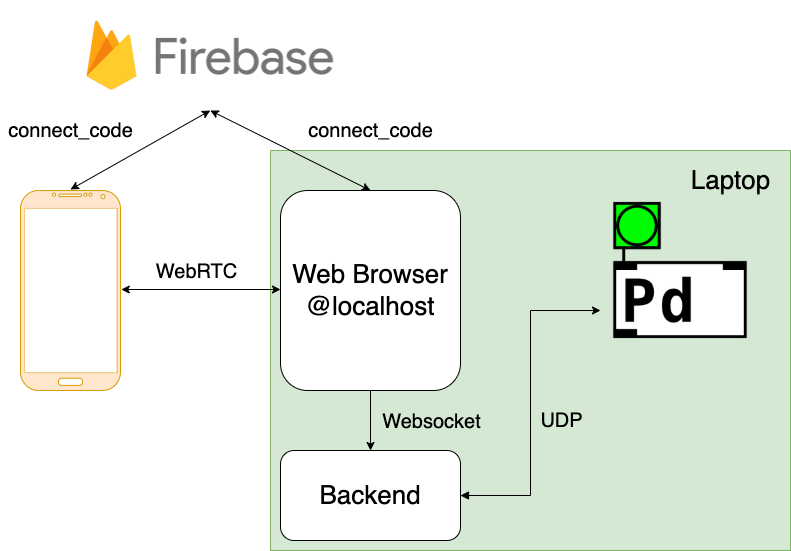

Overall Structure

## TL;DR

In this project, I create a web interface and server for smartphones to send sensor data to pure data with only a simple scan of a QR Code.

Github page: [link](https://github.com/atosystem/sensor_your_music)

## Motivation

Mobile phones are prevalent among people nowadays as well as network connections.
Is there anything we can do with music and people?

> What if we can turn smartphones into instruments via the Internet?

> What if people can join in music with just a scan of a QR Code?

> What if all of us can be part of the music with only smartphones?

I then come up with an idea to transmit phone data to Puredata to make cool music and sound effects.

Smartphones come with plenty of sensors such as accelerometers, gyroscopes, and so on. These built-in sensors can serve as wonderful sound-controlling mediums.
Nonetheless, the most crucial challenge is to make sure of low latency for transmitting data through the Internet to Puredata.

The first thing I thought of is UDP since it is a protocol with low latency.
However, after some trial and survey, most web browsers have strict security restrictions.
It is not possible to initiate a UDP/TCP socket in the web browser due to safety concerns.
Only WebSockets are available but they are based on TCP protocol which doesn't guarantee to transmit speed.
On the other hand, for a web page to gain access to the user's phone sensors, it should be hosted by "https". Also, with `mixed content` constraint, I cannot set up a https website and employ `localhost` WebSocket for communication to speed up the data transmission.

## Method

To solve the problems mentioned above, WebRTC comes into my sight. WebRTC is a communication tool developed by Google mainly for video and audio streaming services.
In this project, I develop a website for users to connect their phones to Puredata via WebRTC, with just a scan of a QRCode.

The following is the basic structure of data transmitting

First, the web browser of localhost is opened. Then it generates a `connect_code` to firebase. The `connect_code` and the webpage for mobile phone is subsequently packed in a QR Code. After the user scans the QR code with his/her phone, the phone's web browser is connected to that of localhost via WebRTC with the matching of `connect_code`. The rest of the data transmission process is purely P2P. As for the server side, the message received by localhost web browser is then sent to the backend server via WebSocket (since only WebSocket is allowed in the web browser). The backend server then sends the message to the corresponding UDP port of Puredata. Puredata employs [netreceive -u \<udp port number\>] to receive the message.
